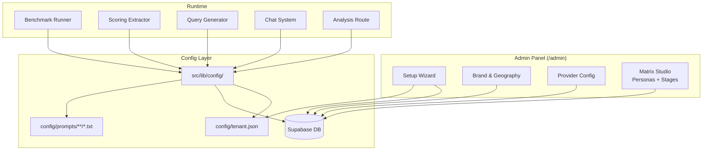

# Design Document: Finish White-Labeling

## Overview

The AI Visibility Matrix platform has a partial white-labeling foundation: a `config/tenant.json` file, a `src/lib/config/` module with typed accessors, DB-backed matrix config for personas/stages, and an admin Matrix Studio page. However, many source files still contain hardcoded brand references ("Lakewood Ranch", "SSES"), hardcoded provider lists, hardcoded entity categories in scoring schemas, and inline LLM prompts that bypass the template system.

This design completes the white-labeling by:

1. Replacing every hardcoded brand/geography/competitor reference with Config_System lookups
2. Adding admin panels for provider configuration, brand/geography setup
3. Extending the existing Matrix Studio for full persona and stage lifecycle management
4. Adding a setup wizard for first-run tenant configuration
5. Externalizing all remaining inline LLM prompts into the `config/prompts/` template system
6. Making test fixtures tenant-agnostic
7. Porting reliability fixes from the baseline repo (xAI Responses API, batched benchmark execution)

The design preserves the existing architecture (Next.js 16 + React 19 + TypeScript, Supabase, shadcn/ui) and extends it incrementally.

## Architecture



The key architectural decisions:

1. **DB as source of truth for mutable config**: Provider config, brand, geography, and competitors move to Supabase tables. `tenant.json` becomes a seed/fallback file. The Config_System reads from DB first, falls back to file.
2. **Prompt templates remain file-based**: The `config/prompts/` directory continues to hold `.txt` templates with `{{variable}}` interpolation. New templates are added for analysis, intent generation, and scoring entity extraction.
3. **Admin panel extends `/admin` route group**: New pages at `/admin/providers`, `/admin/brand`, and `/admin/setup` use the same shadcn/ui patterns as the existing Matrix Studio.
4. **Provider config becomes dynamic**: The `Provider` type becomes a string union extensible via config. The benchmark runner reads active providers from DB instead of a hardcoded array.

## Components and Interfaces

### 1. Tenant Config DB Layer (`src/lib/tenant/db.ts`)

New module for reading/writing tenant configuration to Supabase.

```typescript
// DB table: tenant_config (single-row, key-value JSONB)
interface TenantConfigRow {
  id: string;           // always "default"
  brand_json: BrandConfig;
  competitors_json: Competitor[];
  geography_json: GeographyConfig | null;
  entity_categories_json: EntityCategory[];
  providers_json: ProvidersConfig;
  industry: Industry;
  setup_complete: boolean;
  updated_at: string;
  updated_by: string | null;
}

// Public API
async function getTenantConfigFromDB(): Promise<TenantConfig | null>;
async function saveTenantConfig(config: Partial<TenantConfig>, userId?: string): Promise<void>;
async function isSetupComplete(): Promise<boolean>;
async function markSetupComplete(userId?: string): Promise<void>;
```

### 2. Enhanced Config Loader (`src/lib/config/loader.ts`)

The existing loader gains a DB-first strategy:

```typescript
// Load order:
// 1. Check DB (tenant_config table)
// 2. Fall back to config/tenant.json
// 3. Fall back to DEFAULT_CONFIG
// 4. Apply environment variable overrides (always last)
async function loadTenantConfigAsync(): Promise<TenantConfig>;

// Sync version for backward compatibility (uses cache, populated by async load)
function getTenantConfig(): TenantConfig;
```

### 3. Provider Config Types (`src/lib/config/types.ts`)

Extended to support dynamic provider lists:

```typescript
// New: per-provider config with active flag
interface ProviderEntry {
  id: string;           // "openai", "anthropic", "gemini", "xai", or custom
  label: string;        // Display name
  model: string;        // Model identifier
  weight: number;       // 0-1 scoring weight
  active: boolean;      // Whether to include in benchmarks
  apiKeyEnvVar: string; // Environment variable name for API key
}

// Updated ProvidersConfig
interface ProvidersConfig {
  providers: ProviderEntry[];
}
```

### 4. Admin Pages

#### `/admin/brand` — Brand & Geography Configuration

```typescript
// Client component using useTenantConfig() hook
// Form fields: brand name, aliases, domain, highlight color
// Geography: region, localities, nearby metros
// Competitors: add/remove/edit with name + aliases + isPrimary
// Entity categories: add/remove/edit with id, label, examples
// Save → POST /api/tenant/config
```

#### `/admin/providers` — Provider Configuration

```typescript
// Lists all providers with toggle, model input, weight slider
// Validation: at least one provider active, weights 0-1
// Save → POST /api/tenant/providers
```

#### `/admin/setup` — Setup Wizard

```typescript
// Multi-step form:
// Step 1: Industry template selection (loads defaults)
// Step 2: Brand name, aliases, domain
// Step 3: Competitors
// Step 4: Geography
// Step 5: Provider selection + models
// Step 6: Persona + stage review (pre-populated from template)
// Final: Persist all config, mark setup_complete = true, redirect to /visibility-matrix
```

### 5. API Routes

#### `POST /api/tenant/config` — Save tenant config

```typescript
// Body: Partial<TenantConfig>
// Auth: required
// Validates with Zod, saves to tenant_config table
// Clears config cache
```

#### `POST /api/tenant/providers` — Save provider config

```typescript
// Body: { providers: ProviderEntry[] }
// Auth: required
// Validates at least one active provider
// Saves to tenant_config.providers_json
```

#### `GET /api/tenant/setup-status` — Check if setup is complete

```typescript
// Returns: { setupComplete: boolean }
// Used by middleware to redirect to /admin/setup on first run
```

### 6. Prompt Template Additions

New template files in `config/prompts/`:

```
config/prompts/
├── analysis/
│   ├── consultant.txt          # Replaces hardcoded buildConsultantPrompt()
│   └── hypothesis.txt          # Replaces hardcoded buildHypothesisPrompt()
├── chat/
│   ├── system.txt              # Already exists
│   ├── file-search-system.txt  # Replaces hardcoded buildFileSearchSystemPrompt()
│   └── scope-contexts.txt      # Already exists
├── extraction/
│   ├── explore.txt             # Already exists
│   ├── consider.txt            # Already exists
│   ├── compare.txt             # Already exists
│   ├── decide.txt              # Already exists
│   └── entity-suffix.txt       # Already exists
├── intent-generation/
│   └── system.txt              # Replaces hardcoded generator.ts system prompt
└── query-generation/
    ├── system.txt              # Already exists
    ├── explore.txt             # Already exists
    ├── consider.txt            # Already exists
    ├── compare.txt             # Already exists
    └── decide.txt              # Already exists
```

### 7. Benchmark Runner Reliability Fixes

#### xAI Responses API Migration (`src/lib/providers/xai.ts`)

```typescript
// Switch from /v1/chat/completions to Responses API
// Use tool-based payload semantics for web search
async function callXaiSearch(params: {
  model: string;
  query: string;
}): Promise<XaiResponse>;
```

#### Batched Benchmark Execution (`src/app/api/benchmark/run/route.ts`)

```typescript
// Replace sequential cell processing with batched parallel execution
// Use Promise.allSettled with batch size of 4
// Partial failure tolerance: continue on individual cell failures
// Report failed cells in response without aborting the entire run
```

### 8. Dynamic Triggers (`src/lib/triggers.ts`)

Replace hardcoded trigger lists with config-driven generation:

```typescript
function getCompareTriggers(): string[] {
  const brand = getBrandName();
  const competitors = getCompetitorNames();
  // Generate "Brand vs Competitor" triggers dynamically
  return [
    ...competitors.map(c => `${brand} vs ${c}`),
    `Compare options within ${brand}`,
    "Compare amenities and lifestyle",
    // ... generic triggers
  ];
}
```

### 9. Dynamic Scoring Schema Entity Extraction

Replace the hardcoded `ENTITY_EXTRACTION_SUFFIX` and `STAGE_EXTRACTION_PROMPTS` in `src/lib/scoring/schemas.ts`:

```typescript
// Move entity extraction suffix to config/prompts/extraction/entity-suffix.txt (already exists)
// Move stage prompts to use getExtractionPrompt() from config/prompts.ts (already exists)
// Remove STAGE_EXTRACTION_PROMPTS constant and ENTITY_EXTRACTION_SUFFIX constant
// The extractor.ts already passes brand dynamically — just need to remove hardcoded prompts
```

## Data Models

### New DB Table: `tenant_config`

```sql
CREATE TABLE IF NOT EXISTS tenant_config (
  id TEXT PRIMARY KEY DEFAULT 'default',
  brand_json JSONB NOT NULL DEFAULT '{}',
  competitors_json JSONB NOT NULL DEFAULT '[]',
  geography_json JSONB,
  entity_categories_json JSONB NOT NULL DEFAULT '[]',
  providers_json JSONB NOT NULL DEFAULT '{}',
  industry TEXT NOT NULL DEFAULT 'other',
  setup_complete BOOLEAN NOT NULL DEFAULT false,
  created_at TIMESTAMPTZ NOT NULL DEFAULT NOW(),
  updated_at TIMESTAMPTZ NOT NULL DEFAULT NOW(),
  updated_by UUID
);
```

### Updated Provider Config Shape

```typescript
// Before (fixed 4-provider structure):
{
  weights: { openai: 0.4, gemini: 0.3, anthropic: 0.2, xai: 0.1 },
  models: { openai: "gpt-5.2", gemini: "gemini-3-flash", ... }
}

// After (dynamic provider list):
{
  providers: [
    { id: "openai", label: "OpenAI", model: "gpt-5.2", weight: 0.4, active: true, apiKeyEnvVar: "OPENAI_API_KEY" },
    { id: "anthropic", label: "Anthropic", model: "claude-4.5-sonnet", weight: 0.2, active: true, apiKeyEnvVar: "ANTHROPIC_API_KEY" },
    { id: "gemini", label: "Google Gemini", model: "gemini-3-flash", weight: 0.3, active: true, apiKeyEnvVar: "GEMINI_API_KEY" },
    { id: "xai", label: "xAI", model: "grok-4.1", weight: 0.1, active: true, apiKeyEnvVar: "XAI_API_KEY" },
  ]
}
```

### Backward Compatibility

The existing `ProviderWeights` and `ProviderModels` types are preserved as computed views over the new `ProviderEntry[]` array. Functions like `getProviderWeight("openai")` continue to work by looking up the provider by id.

### Industry Templates (`config/templates/`)

Each template is a complete `TenantConfig` JSON that the setup wizard loads as a starting point:

```typescript
interface IndustryTemplate {
  industry: Industry;
  brand: Partial<BrandConfig>;      // Placeholder values
  competitors: Competitor[];         // Example competitors
  personas: PersonaConfig[];         // Industry-appropriate personas
  stages: StageConfig[];             // Industry-appropriate stages
  entityCategories: EntityCategory[];
  geography: Partial<GeographyConfig>;
}
```


## Correctness Properties

*A property is a characteristic or behavior that should hold true across all valid executions of a system — essentially, a formal statement about what the system should do. Properties serve as the bridge between human-readable specifications and machine-verifiable correctness guarantees.*

### Property 1: Config accessor round-trip

*For any* valid `TenantConfig` object, saving it to the DB via `saveTenantConfig()` and then reading it back via `getTenantConfig()` accessor functions (`getBrandName()`, `getBrandAliases()`, `getCompetitorNames()`, `getEntityCategories()`, etc.) SHALL return values equivalent to the original config.

**Validates: Requirements 1.1, 1.2**

### Property 2: Prompt interpolation reflects config

*For any* valid `TenantConfig`, all prompts built by the Prompt_Template_System (`getExtractionPrompt()`, `getQueryGenerationPrompt()`, `getChatSystemPrompt()`, analysis prompts, intent generation prompts) SHALL contain the configured `brand.name` and SHALL NOT contain any hardcoded brand string that differs from the configured value.

**Validates: Requirements 1.3, 1.4, 1.5, 1.6, 1.7, 1.10, 6.1, 6.2, 6.3, 6.4, 6.5**

### Property 3: Dynamic triggers from config

*For any* `TenantConfig` with a non-empty brand name and at least one competitor, the generated compare-stage triggers SHALL contain at least one trigger string that includes the configured brand name and at least one trigger string that includes a configured competitor name.

**Validates: Requirements 1.8, 8.2**

### Property 4: Provider config round-trip with validation

*For any* `ProviderEntry` array where each entry has a non-empty model string and a weight in [0, 1], saving via the provider config API and reading back SHALL return an equivalent provider list. For entries with empty model strings or weights outside [0, 1], the save SHALL be rejected.

**Validates: Requirements 2.2, 2.3, 2.4**

### Property 5: Benchmark uses only active providers

*For any* provider configuration where some providers are active and some are inactive, the benchmark runner SHALL only invoke API calls for providers marked as active. The set of providers in the benchmark result SHALL be a subset of the active providers.

**Validates: Requirements 2.5**

### Property 6: Matrix config round-trip

*For any* valid persona or stage object (with non-empty id and label), adding it via the Matrix Studio API and then reading the active config back SHALL include that persona or stage with the correct label, description, and orderIndex. Renaming a label and reading back SHALL reflect the new label. Reordering and reading back SHALL reflect the new order indices.

**Validates: Requirements 3.1, 3.2, 3.3, 4.1, 4.2, 4.3**

### Property 7: Deactivation excludes from active list

*For any* active persona or stage, deactivating it via the Matrix Studio API SHALL cause it to be excluded from the active config returned by `getActiveMatrixConfig()`. The deactivated item SHALL still exist in the database (soft delete).

**Validates: Requirements 3.4, 3.6, 4.4, 4.5**

### Property 8: Wizard config persistence

*For any* valid wizard input (brand, competitors, geography, providers, personas, stages), completing the setup wizard SHALL result in `isSetupComplete()` returning true and `getTenantConfig()` returning a config that matches the wizard input. For any skipped step, the resulting config section SHALL match the selected industry template's defaults for that section.

**Validates: Requirements 5.6, 5.7**

## Error Handling

| Scenario | Handling |
|----------|----------|
| DB unavailable during config load | Fall back to `config/tenant.json`, then to `DEFAULT_CONFIG`. Log warning. |
| Prompt template file missing | `loadPromptTemplate()` returns `null`. Caller uses inline fallback prompt and logs warning. |
| Provider API key missing at runtime | Benchmark runner skips that provider, logs warning, continues with remaining providers. |
| All providers disabled | Admin panel shows warning (Req 2.6). Benchmark run API returns 400 with descriptive error. |
| Invalid provider weight (outside 0-1) | Zod validation rejects at API boundary. 400 response with validation errors. |
| Setup wizard interrupted mid-flow | Partial config saved per-step. Wizard resumes from last completed step on next visit. |
| Concurrent config edits | Last-write-wins with `updated_at` timestamp. No optimistic locking needed for single-operator use case. |
| xAI Responses API error | Return partial result for the benchmark. Log error. Mark cell as failed in progress tracking. |
| Benchmark cell failure (any provider) | `Promise.allSettled` captures the failure. Other cells continue. Failed cells reported in response. |
| Empty tenant_config table | Treated as first-run. `isSetupComplete()` returns false. Middleware redirects to setup wizard. |

## Testing Strategy

### Unit Tests

Unit tests cover specific examples and edge cases:

- Config loader: test fallback chain (DB → file → default → env overrides)
- Provider validation: test boundary values (weight = 0, weight = 1, weight = -0.1, weight = 1.1)
- Prompt interpolation: test with missing variables (should preserve `{{placeholder}}`)
- Setup wizard: test step navigation, skip behavior, template loading
- xAI Responses API: test response parsing, error handling
- Batched execution: test with 0 cells, 1 cell, 16 cells, partial failures
- Trigger generation: test with 0 competitors, 1 competitor, many competitors
- Deactivation: test that deactivated items don't appear in active queries

### Property-Based Tests

Property-based tests use `fast-check` (already available in the Node.js ecosystem, compatible with vitest).

Each property test runs a minimum of 100 iterations and is tagged with its design property reference.

- **Property 1**: Generate arbitrary `TenantConfig` objects, save to mock DB, read back via accessors, assert equality.
  - Tag: `Feature: finish-white-labeling, Property 1: Config accessor round-trip`
- **Property 2**: Generate arbitrary `TenantConfig` objects, build all prompt types, assert each contains `config.brand.name` and does not contain any known hardcoded brand string.
  - Tag: `Feature: finish-white-labeling, Property 2: Prompt interpolation reflects config`
- **Property 3**: Generate arbitrary brand names and competitor lists, generate triggers, assert brand and competitor presence.
  - Tag: `Feature: finish-white-labeling, Property 3: Dynamic triggers from config`
- **Property 4**: Generate arbitrary `ProviderEntry[]` arrays with valid/invalid weights and models, test save/read round-trip and validation rejection.
  - Tag: `Feature: finish-white-labeling, Property 4: Provider config round-trip with validation`
- **Property 5**: Generate arbitrary provider configs with random active/inactive flags, mock benchmark execution, assert only active providers are called.
  - Tag: `Feature: finish-white-labeling, Property 5: Benchmark uses only active providers`
- **Property 6**: Generate arbitrary persona/stage objects, add/rename/reorder via API, read back, assert consistency.
  - Tag: `Feature: finish-white-labeling, Property 6: Matrix config round-trip`
- **Property 7**: Generate arbitrary active personas/stages, deactivate one, assert it's excluded from active list but still in DB.
  - Tag: `Feature: finish-white-labeling, Property 7: Deactivation excludes from active list`
- **Property 8**: Generate arbitrary wizard inputs with random skipped steps, complete wizard, assert config matches input (or template defaults for skipped steps).
  - Tag: `Feature: finish-white-labeling, Property 8: Wizard config persistence`
